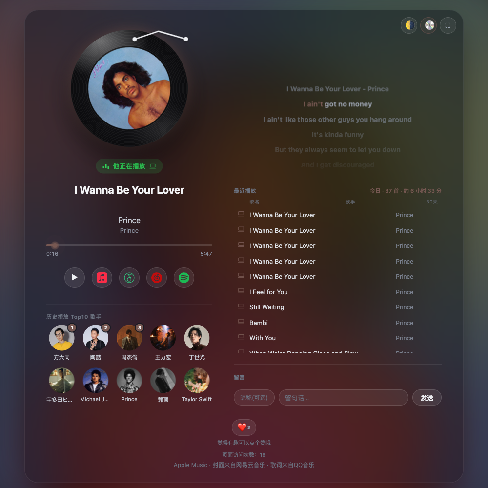
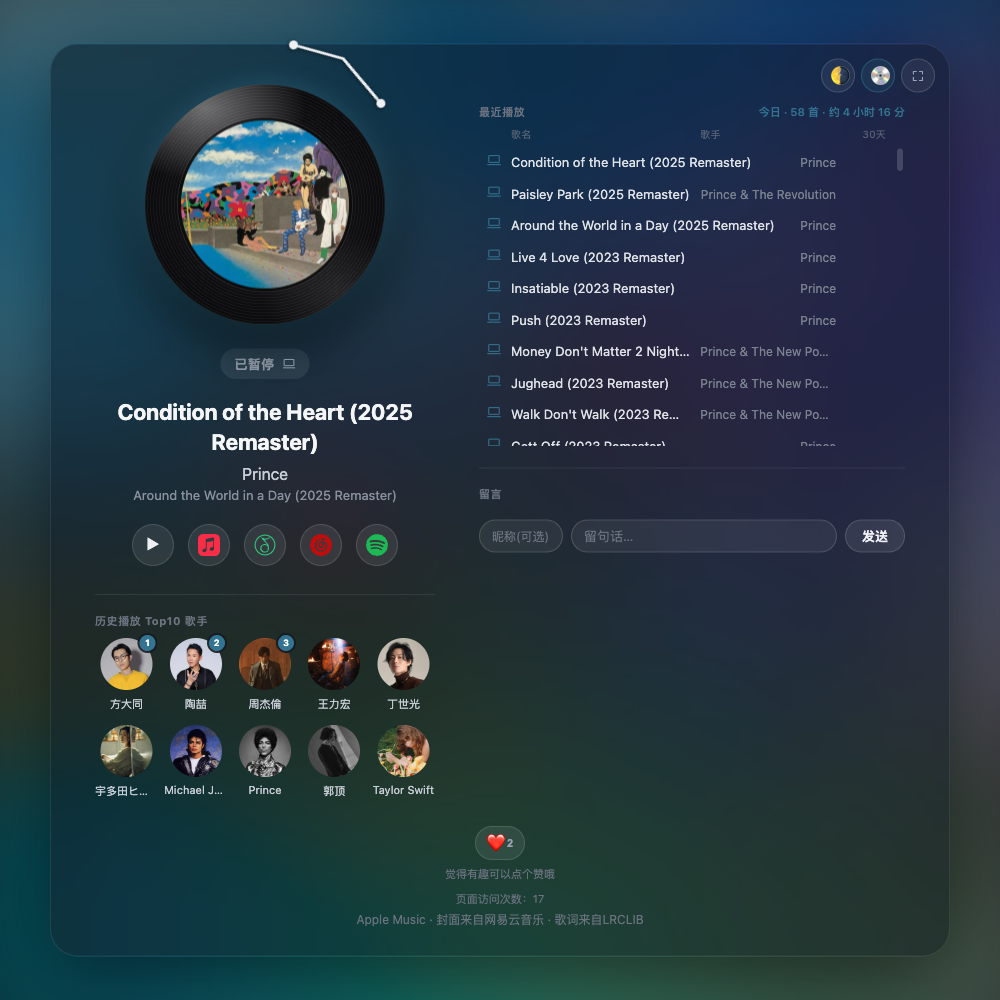

<div align="center">

# Now Playing ♪

**A shareable, live "what I'm listening to" page for Apple Music — synced lyrics, vinyl mode, a guestbook, all in one static HTML file.**

**Language / 语言:** **English** | [简体中文](README.zh-CN.md)


[](LICENSE)

[**Live demo →**](https://yudaotor.github.io/nowplaying/?user=yudaotor)

</div>

<div align="center">

<br>
<sub>Playing — word-by-word lyrics, background tinted from the cover art</sub>

<br>
<sub>Vinyl mode — the tonearm lifts when paused</sub>

</div>

## Highlights

- **Live now-playing card** — cover art, title/artist/album, a real-time progress bar (extrapolated client-side, not polled every second), and a Mac/iPhone device icon
- **Word-by-word synced lyrics** with translation/romanization lines, auto-following the current line
- **Vinyl mode** 💿 — the cover shrinks to a record label, spins while playing, tonearm lifts on pause (pure CSS + Web Animations, no battery cost)
- **Recent plays** with today/earlier grouping and 30-day play counts, plus an all-time **Top-10 artists** leaderboard
- **Guestbook, ❤️ reactions, and a visitor counter** for your visitors
- **Bilingual UI** — auto-detects the visitor's browser language (English/Chinese), manual 🌐 toggle, choice remembered
- **Ambient / light themes and an immersive fullscreen mode** — nice on a tablet or a second monitor
- **Rich link previews** — paste the link in Slack/Discord/WeChat and it unfurls with the current track and cover
- **One self-contained `index.html`** — no framework, no build step; host it on any static host

<details>
<summary><b>Full module tour</b> (what each piece actually does)</summary>

- **Now-playing card**: cover art (with a gentle breathing zoom), title/artist/album, a progress bar (extrapolated in real time client-side, not polled every second), a playback-state pill ("Now Playing" / "Paused" / "Last played · N minutes ago"), and a Mac/iPhone device icon. If the cover art isn't available yet, the client falls back to an iTunes Search placeholder and swaps in the real cover seamlessly once the server resolves it.
- **Vinyl mode** (💿 top right): shrinks the cover art down to the "label" at the center of a vinyl record, spinning at a steady rate while playing and lifting the tonearm when paused. It's a toggle against "square cover" mode, remembered per browser, and doesn't affect what other visitors see.
- **Synced lyrics**: only shown when something is actually playing with a precise progress position. Supports word-by-word highlighting (NetEase's yrc format) and whole-line highlighting, with romanization/translation each on their own line. Manually scrolling the lyrics panel pauses auto-follow; it resumes tracking the current line a few seconds after you stop touching it.
- **Recent playback history**: split into "today" and "earlier," each row tagged with a device icon plus a play count for the last 30 days (only shown once it's ≥2, so the list isn't cluttered with uninformative "×1" badges). Today gets its own summary line, "Today · N songs · about X hr Y min."
- **Guestbook**: leave a message anonymously (or with a nickname), shared site-wide, capped at the latest 50 entries. Rendered purely via `textContent`, which naturally rules out XSS.
- **Reactions**: a single ❤️ button with a site-wide cumulative like count.
- **Visitor counter**: counted once per browser (deduplicated via `localStorage`).
- **Top 10 artists (all-time)**: a standing leaderboard ranked by total play count, recomputed once a day. The top three get rank badges; avatars come from QQ Music, falling back to Deezer and then to a circular initial placeholder.
- **Theme / immersive mode**: 🌗 toggles between "ambient" (a blurred version of the cover art as the background) and "light"; ⛶ enters an immersive fullscreen mode that hides secondary information and enlarges the cover art and lyrics.
- **Social sharing**: paste the link into WeChat, Slack, or Discord and it unfurls into a preview card showing the currently-playing title + cover art.

</details>

## Run your own

Two ways, depending on how much you want:

| | What you get | Where to start |
|---|---|---|
| **Zero-backend** | Now-playing + history, straight from [ListenBrainz](https://listenbrainz.org/) — no server, no deploy, just a static file | [`demo/`](demo) — a fork-ready template with a [5-minute guide](demo/README.md) |
| **Full experience** | Everything above plus the guestbook, reactions, visitor counter, Top-10 artists, and lower-latency updates | Deploy the free Cloudflare Worker relay from [`Yudaotor/nowplaying-workers`](https://github.com/Yudaotor/nowplaying-workers#readme) — its README is a complete from-scratch walkthrough |

### URL parameters

| Parameter | Meaning |
|---|---|
| `?user=<name>` | ListenBrainz username to display (required) |
| `?relay=<url>` | Read from your own relay Worker instead of the built-in default |
| `?relay=off` | Skip the relay entirely and read ListenBrainz directly |

## What's in this repo

- [`index.html`](index.html) — the author's own live page (the demo link above), with the author's relay address baked in
- [`demo/`](demo) — the same page, genericized for forking: no personal relay, no personal metadata, relay defaults to off
- [`sw.js`](sw.js) — a small service worker that caches the page shell and cover art for instant repeat visits (used by the author's deployment; the template skips it on purpose)

## How it fits together

```
Lyrimuse (macOS app + collector)  ──push──▶  state-worker (Cloudflare Worker + KV)  ◀──read──  this page
                                                                                        └──fallback──▶ ListenBrainz
```

| Repo | Role |
|---|---|
| **Yudaotor/nowplaying** (this repo) | The web page itself |
| [**Yudaotor/nowplaying-workers**](https://github.com/Yudaotor/nowplaying-workers) | The optional Cloudflare Worker relay behind it, plus a live README badge |
| **Lyrimuse** | The macOS menu-bar lyrics app whose collector pushes live state (not yet open-source — the page runs fine without it on the ListenBrainz fallback) |
